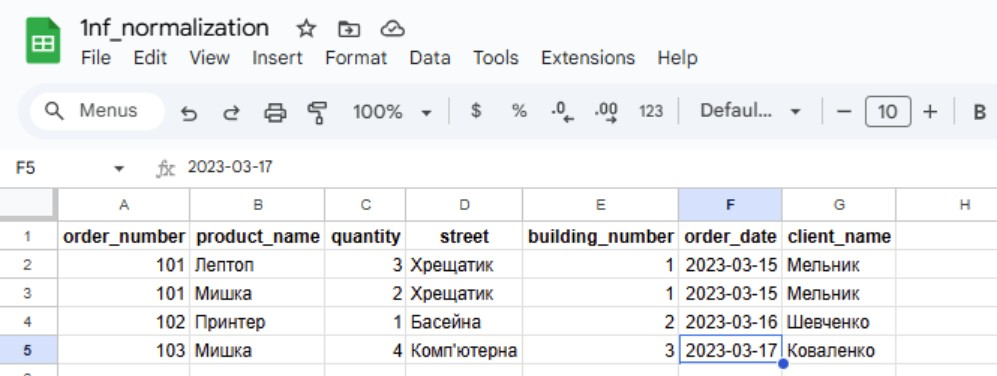
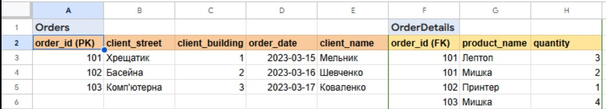
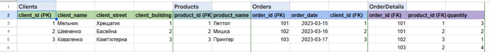
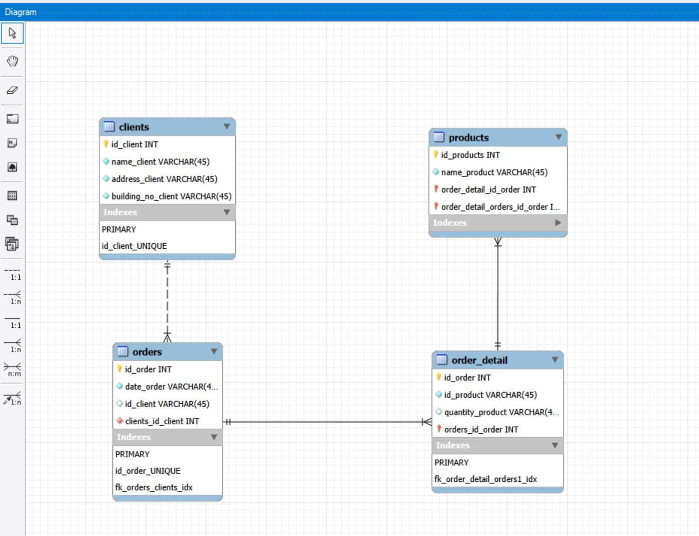

# Домашнє завдання — Тема 2. Проектування баз даних з використанням семантичних моделей

Коротко: перевести таблицю до нормалізованої форми (1НФ, 2НФ, 3НФ), створити
ER-діаграму та реалізувати таблиці в базі даних на основі ER-діаграми.

## Що потрібно зробити

- Перевести початкову таблицю до першої нормальної форми (1НФ).
- Перевести нові таблиці до другої нормальної форми (2НФ).
- Перевести нові таблиці до третьої нормальної форми (3НФ).
- Розробити ER-діаграму отриманих таблиць.
- Створити таблиці в базі даних на основі ER-діаграми (тільки структура, без
  даних).

## Опис завдання

Сьогодні ви опануєте практичні аспекти впровадження концепцій нормалізації баз
даних та моделювання сутність-зв'язок (ER). Ці навички є важливими для
будь-якого розробника та відіграють ключову роль у створенні ефективних і добре
структурованих систем керування інформацією.

Це завдання допоможе вам:

- Опанувати техніку переведення даних у нормалізовану форму для забезпечення
  їхньої ефективності та послідовності.
- Зрозуміти, як визначати й моделювати сутності та їхні взаємозв'язки, що є
  важливим для правильної організації інформації в базі даних.

## Кроки виконання

1. **Переведіть початкову таблицю в першу нормальну форму (1НФ).**

   - Скріншот: результат нормалізації таблиці до 1НФ (1_1_1nf_normalization.png)

2. **Переведіть нові таблиці в другу нормальну форму (2НФ).**

   - Скріншот: результат нормалізації таблиць до 2НФ (2_1_2nf_normalization.png)

3. **Переведіть нові таблиці в третю нормальну форму (3НФ).**

   - Скріншот: результат нормалізації таблиць до 3НФ (3_1_3nf_normalization.png)

4. **Розробіть ER-діаграму отриманих таблиць.**

   Використовуйте зрозумілі та конкретні імена для сутностей та атрибутів.
   Уточнюйте типи даних для атрибутів. Перевірте, чи всі відношення й атрибути
   мають чіткі і зрозумілі кардинальності та значення.

   - Скріншот: ER-діаграма з усіма сутностями та зв'язками (4_1_er_diagram.png)

5. **Використовуючи ER-діаграму, створіть таблиці в базі даних.** Оформіть ці
   таблиці без конкретних значень, тільки з урахуванням колонок та їхніх
   зв'язків, вручну або автоматично.

   - Скріншот: розгорнута схема таблиць у Workbench з усіма зв'язками
     (5_1_database_schema.png)

## Початкова таблиця

| Номер_замовлення | Назва_товару і кількість | Адреса_клієнта | Дата_замовлення | Клієнт    |
| ---------------- | ------------------------ | -------------- | --------------- | --------- |
| 101              | Лептоп: 3, Мишка: 2      | Хрещатик 1     | 2023-03-15      | Мельник   |
| 102              | Принтер: 1               | Басейна 2      | 2023-03-16      | Шевченко  |
| 103              | Мишка: 4                 | Комп'ютерна 3  | 2023-03-17      | Коваленко |

## Критерії прийняття

1. Прикріплені посилання на репозиторій goit-rdb-hw-02 та безпосередньо самі
   файли репозиторію архівом.
2. Нормалізовано таблицю до 1НФ.
3. Нормалізовано таблицю до 2НФ.
4. Нормалізовано таблицю до 3НФ.
5. Створено ER-діаграму отриманих таблиць. Діаграма має відповідати
   нормалізованим таблицям.
6. Використано зрозумілі та конкретні імена для сутностей та атрибутів. Уточнено
   типи даних для атрибутів. Усі відношення й атрибути мають чіткі і зрозумілі
   кардинальності та значення.
7. Створено таблиці в базі даних (тільки таблиці й колонки з урахуванням
   зв'язків) вручну або автоматично.

## Формат здачі

- Прикріплені файли репозиторію архівом із назвою ДЗ2\_\_ПІБ.
- Посилання на репозиторій.

---

## Артефакти виконання завдання

### models/

- `1nf_normalization.ods` - таблиці нормалізації з 1НФ до 3НФ
- `er_diagram.mwb` - ER-діаграма у форматі MySQL Workbench

### screenshots/

- `1_1nf_normalization.png` - скріншот нормалізації до 1НФ
  
- `2_2nf_normalization.png` - скріншот нормалізації до 2НФ
  
- `3_3nf_normalization.png` - скріншот нормалізації до 3НФ
  
- `4_er_diagram.png` - скріншот ER-діаграми
  
- `5_database_schema.png` - скріншот схеми бази даних
  
